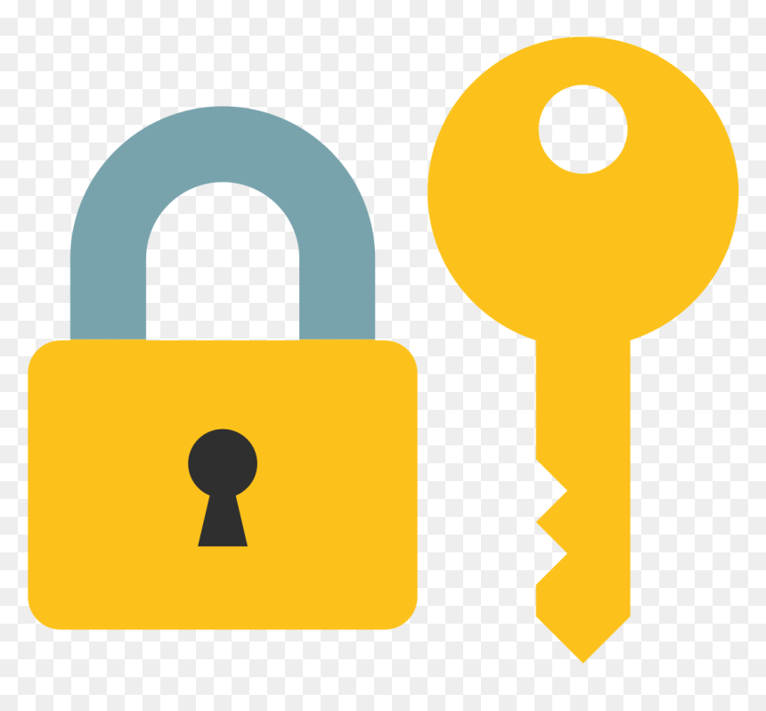

# SecureApp [v0.1](CHANGELOG.md)

**⚠️ WARNING: Early Development Stage**

SecureApp is currently in the early stages of development, and it's crucial to be aware of the following cautions before proceeding:

1. **Experimental Nature:** SecureApp is an experimental project and is not yet suitable for production use. It is subject to significant changes, and features may be added, modified, or removed as development progresses.

2. **Limited Stability:** The application may lack certain stability and robustness expected in fully matured software. Users are likely to encounter bugs, unexpected behavior, or incomplete features during usage.

3. **Security Considerations:** As an experimental project, SecureApp has not undergone extensive security audits. Users should exercise caution when handling sensitive information and avoid using real or sensitive credentials during testing.

4. **Leaked SQL Files:** Be aware of the risk of unintentional leakage of SQL files or sensitive data during the development phase. Exercise caution when sharing or distributing any database files generated by the application.

5. **Security Issues:** Due to the early development stage, SecureApp may have security vulnerabilities that are yet to be identified and addressed. Use the application at your own risk, and report any security concerns or issues promptly.

It is strongly recommended to use SecureApp in a controlled and testing environment only. Avoid using it with critical or sensitive data, and always have backups before testing.

## About
SecureApp is a C++ application designed for secure user authentication and includes a Graphical User Interface (GUI). [Learn more](#link-to-more-info).

## How to Get Started

Clone this repository or download the zip file from GitHub Releases. Follow the instructions below to set up and run the application on your local machine.

### Prerequisites

- C++ compiler that supports C++14 standard.
- SQLite library.
- OpenSSL library.
- CMake for building the project.

### Build Instructions

1. Clone the repository.
2. Install necessary dependencies (SQLite, OpenSSL).
3. Create a build directory: `mkdir build && cd build`.
4. Run CMake: `cmake ..`.
5. Build the project: `cmake --build .`.

### Usage

- Run the executable generated in the build directory after successful compilation.
- Follow the on-screen instructions for user login or signup.

## Contributing

Contributions are welcome! Feel free to open issues or submit pull requests.

## License

SecureApp uses the MIT License.

## Browse

[Browse v0.1](CHANGELOG.md)
